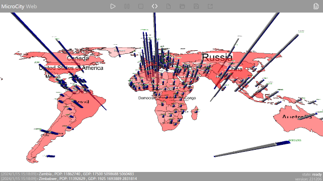

# 1.1 What MicroCity can Do
The objective of MicroCity Web is to provide an **easy and fast** tool for logistics modelling which can **run anywhere**.

## A Data Analysis Appliance 
Through programmable scripts and a rich 2D/3D scene library, MicroCity Web can be used to analysis and vividly display a variety of data.

## A Model Manipulation Gadget
Based on the built-in script debugging feature and a Mixed Integer Programming library, MicroCity Web can be used to create logistics models and fine-tune their parameters.

## A Simulation Platform
Thanks to the Discrete Event Simulation library, MicroCity Web can dynamically evaluate various logistics scenarios and display them in an animated manner.

[Table of Contents](readme.md) | [2.1 Rolling a Cube >](2.1_rolling_a_cube.md)