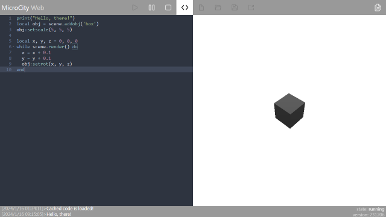

# 2.1 Rolling A Cube
This tutorial is to guide you in using the MicroCity Web User Interface.

## Running the Script
When you open MicroCity Web for the first time, a sample script will be automatically loaded into the script editor on the left. Click the **Run** button, a "hello, there!" message will appear in the message bar below, and a rolling cube will appear in the scene canvas on the right. You can also use the buttons to **pause** or **stop** the cube, or click the **code**  button to hide the script editor and expand the scene canvas. For more information on running scripts please refer to [3.2 Running Scripts](3.2_running_scripts.md).



## Editing the Script
The MicroCity script uses the Lua language. Please read the explanation carefully to understand the behavior of the sample script. Please refer to Section 4.3 for details on control scenarios and object functions. If you want to make changes, add the following code before obj:setrot(x, y, z):
`z = z + 0.1`

```
z = z + 0.1
```

This code will change the way the cube rotates. You can save the new code locally or publish it online, and MicroCity will generate a URL similar to https://microcity.gitee.io/#xxxxxx. Others can access the MicroCity application you created or modify your code through this URL.


## Navigating the Scene


[< 1.1 What MicroCity Web can Do](1.1_what_microcity_web_can_do.md) | [Table of Contents](readme.md) | [2.2 Searching for Countries >](2.2_searching_for_countries.md)