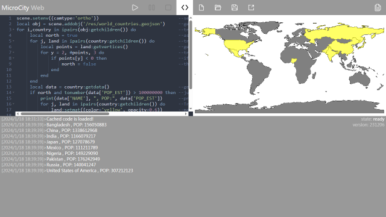

[< 2.1 Rolling a Cube](2.1_rolling_a_cube.md) | [Table of Contents](readme.md) | [3.1 UI Overview >](3.1_ui_overview.md)

# 2.2 Searching for Countries
This tutorial is to guide you in using the MicroCity Web Scripting Interfaces. 

## The Data Structure of Scene Objects
In the scene, you can load built-in objects such as 'box', 'sphere', etc., and you can also import external json files such as geojson and gltf. All objects loaded in the scene can be classified into three basic types, named **points**, **polyline** and **mesh** (polygon is a special type of mesh). Object data is organized into a hierarchical tree structure as shown below. You can find more information about object in [4.3 Scene and Object](4.3_scene_and_object.md). 


## Making a Query
You can open a sample script by **new** -> **The World Map**. **Run** and maps and related information for all countries in the world are displayed. Now suppose we want to find countries, each of which has a population of more than 100 million and is entirely in the northern hemisphere. So we need to check the population of each country and every point's coordinate of the country polygon. Here are the total codes.

```
scene.setenv({camtype='ortho'})                              --set the scene camera to orthographic projection
local obj = scene.addobj('/res/world_countries.geojson')     --get the world's national geographic data
for i,country in ipairs(obj:getchildren()) do                --traverse each country
     local north = true                                      --assume the country is in the northern hemisphere
     for j, land in ipairs(country:getchildren()) do         --traverse all the territories of this country
         local points = land:getvertices()                   --get all vertex coordinates
         for y = 2, #points, 3 do                            --traverse the y coordinates in the vertex coordinates
             if points[y] < 0 then                           --if the latitude is less than 0 (y<0)
                 north = false                               --the territory is not entirely in the northern hemisphere
             end
         end
     end
     local data = country:getdata()                          --get country attribute data
     if north and tonumber(data['POP_EST']) > 100000000 then --judge if two conditions are met
         print(data['NAME'], ", POP:", data['POP_EST'])      --print the country name and population
         for j, land in ipairs(country:getchildren()) do     --Traverse all the territories of this country
             land:setmat({color='yellow', opacity=0.6})      --marked yellow and slightly transparent
         end
     end
end
scene.render()                                               --render the scene
```

## Showing Results
**Run** the script The searched countries will be highlighted and information will be printed in the **message bar** below. You can click the message bar to enlarge it.


[< 2.1 Rolling a Cube](2.1_rolling_a_cube.md) | [Table of Contents](readme.md) | [3.1 UI Overview >](3.1_ui_overview.md)