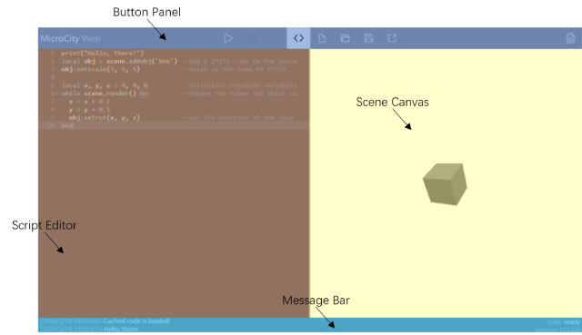

[< 2.2 Searching for Countries](2.2_searching_for_countries.md) | [Table of Contents](readme.md) | [3.2 Running Scripts >](3.2_running_scripts.md)

# 3.1 UI Overview
MicroCity Web provides a compact and versatile user interface.

## Interface Partitions and Functions
The user interface of MicroCity Web is divided into four parts: **Button Panel**, **Script Editor**, **Scene Canvas** and **Message Bar** as shown in the figure below, and mainly performs three major functions which will discussed later: [3.2 Running Scripts](3.2_running_scripts.md), [3.3 Editing Scripts](3.3_editing_scripts.md) and [3.4 Navigating Scenes](3.4_navigating_scenes.md).

## Button Panel

## Script Editor

## Scene Canvas

## Message Bar

[< 2.2 Searching for Countries](2.2_searching_for_countries.md) | [Table of Contents](readme.md) | [3.2 Running Scripts >](3.2_running_scripts.md)