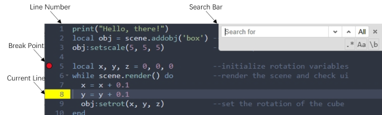
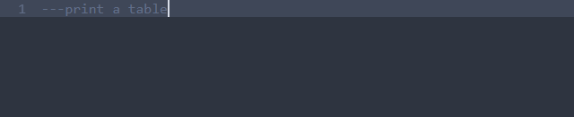

[< 3.1 UI Overview](3.1_ui_overview.md) | [Table of Contents](readme.md) | [3.3 Running Scripts >](3.3_running_scripts.md)

# 3.2 Editing Scripts
MicroCity Web applications are written by <a href="https://www.lua.org/manual/5.4/manual.html" target="_blank">Lua Script</a>. In addition to being familiar with Lua's syntax, users also need to be proficient in using a script editor.

## Script Editor
The Script Editor integrated is based on <a href="https://github.com/ajaxorg/ace" target="_blank">Ace</a>, which is easy to use and has many features. The following figure shows the graphics and symbols that often appear in the editor window. The "Break Point" and "Current Line" are used when [debugging the script](3.3_running_scripts.md).

## Keyboard Shortcuts
Most of the shortcut keys follow the <a href="https://github.com/ajaxorg/ace/wiki/Default-Keyboard-Shortcuts" target="_blank">settings in Ace</a>, and some are customized by MicroCity Web. The most commonly used ones are listed here.
- `Ctrl-B` New file
- `Ctrl-S` Save file
- `Ctrl-O` Open file
- `Ctrl-Z` Undo
- `Ctrl-Y` Redo
- `Ctrl-F` Find
- `Ctrl-H` Replace
- `Ctrl-/` Toggle comment
- `Tab` Indent
- `Shift-Tab` Outdent

## Code Generation
The script can be automatically generated by AI. Just type three "-" at the beginning of a line, then enter the prompt word and press Enter:

[< 3.1 UI Overview](3.1_ui_overview.md) | [Table of Contents](readme.md) | [3.3 Running Scripts >](3.3_running_scripts.md)