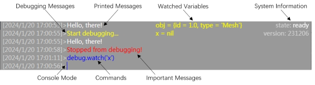

[< 3.2 Editing Script](3.2_editing_scripts.md) | [Table of Contents](readme.md) | [3.4 Navigating Scenes >](3.4_navigating_scenes.md)

# 3.3 Running Scripts
MicroCity Web provides a compact and versatile user interface.

## Message Bar
In order to save space, the message bar is usually folded. You can enlarge it when you **left-click** it. The message bar displays various information as shown in the figure below. When you **right-click** it, it prompts a console cursor. In this mode, you can enter commands to control the execution of Lua scripts. This is especially useful when debugging scripts.

## Running, Pausing and Stopping
The Lua engine is used to execute scripts. There are **four states** of the Lua engine in the system information section of the message bar:
1. ready: completely stopped and waiting for running
2. running: in executing the script 
3. debugging: executing in debug mode 
4. paused: execution is suspended

You can click **Run** to start execution. Click **Pause** to suspend the execution, but this function requires the support of [os.getready](4.2_operation_system.md) or [scene.render](4.3_scene_and_object.md). Click **Stop** to halt the execution or **right-click** it to kill the execution process and restart the engine.

## Debugging
You can start executing the script in debug mode by **Right-click** **Run**. Debugging messages are printed in yellow color. Click on the left margin of the [Script Editor](3.2_editing_scripts.md) line number to set **breakpoints**. The execution will be suspended by these breakpoints or by clicking **pause** button. Variables in script can be watched by using debug.watch command in the console. Other commands or legal **Lua script snippets** can be executed in the console to alter the system. Below is a table of debug commands and the corresponding shortcuts.

|Command|Shortcut|Remark|
|---|---|---|
|debug.debug||Enter Debug Mode|
|debug.pause|F6|Pause the execution|
|debug.cont|F5|Continue the execution|
|debug.step|F9|Step over|
|debug.stepi|F10|Step in|
|debug.stepo|F11|Step out|
|debug.watch||Watch variables|

[< 3.2 Editing Script](3.2_editing_scripts.md) | [Table of Contents](readme.md) | [3.4 Navigating Scenes >](3.4_navigating_scenes.md)