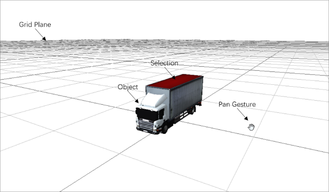
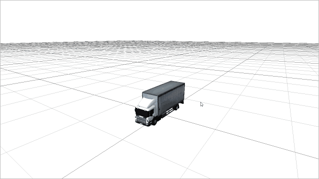

[< 3.3 Running Scripts](3.3_running_scripts.md) | [Table of Contents](readme.md) | [4.1 SI Overview >](4.1_si_overview.md)

# 3.4 Navigating Scenes
[3D/2D objects](3.1_ui_overview.md) loaded or generated by scripts can be displayed on the scene canvas, and users can view them from different angles through navigation gestures.

## Scene Canvas
You can create a new script copying from the 'Loading GLTF' sample and run it. The scene canvas can display a 3D virtual world. The relationship between the xyz coordinate axes satisfies the **right-hand** rule (as shown in the figure), and the initial position of the camera is **(20, 10, 20)**. When the scene camera is set to z-axis **orthogonal** projection (camtype='ortho'), the 3D world displayed in the scene canvas will become '2D', and the initial position of the camera is **(0, 0, 1)**. Object can be selected, and the **selection** is then processed in the script. Other operations lick translation, rotation and scaling can also be done through scripts. The rotation obey the **right-hand** rule. For details, please refer to [4.3 Scene and Object](4.3_scene_and_object.md).

## Navigation Gestures
Similar to [2.1 Rolling a Cube](2.1_rolling_a_cube.md), here we present another example which is more easier to understand and practice, see below:

## External Tools
For easier editing and previewing of objects, here are some useful tools:
- A GeoJSON file editor: <a href="https://geojson.io" target="_blank">https://geojson.io</a>
- A GIS file editor and converter: <a href="https://mapshaper.org" target="_blank">https://mapshaper.org</a>
- A 3D file viewer: <a href="https://3dviewer.net" target="_blank">https://3dviewer.net</a>
- A 3D file editor and converter: <a href="https://www.gltfeditor.com" target="_blank">https://www.gltfeditor.com</a>

[< 3.3 Running Scripts](3.3_running_scripts.md) | [Table of Contents](readme.md) | [4.1 SI Overview >](4.1_si_overview.md)