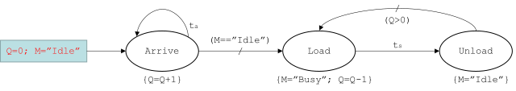

[< 4.3 Scene and Object](4.3_scene_and_object.md) | [Table of Contents](readme.md) | [4.5 Mixed Integer Programming >](4.5_mixed_integer_programming.md)

# 4.4 Discrete Event Simulation
In simulation, events need to be randomly generated and scheduled, so the random number and coroutine functions in Lua have been improved.

## Random Number Generation
The probability distribution of random numbers has been expanded, but the traditional usage is still maintained.

<a id='math.randomseed'> math.randomseed (x, [, disttab]) </a>

Return a seed according to the integer parameters x and the optional table of disttab. The options in disttab:
- dist: Probability distribution, one of "normal", "exponential", "poisson" and "uniform". Default is "uniform".
- mu: Mean or expected value. Default is 1.
- sigma: Standard deviation (only applicable for normal distribution). Default is 1.

<a id='math.random'> math.random ([seed|m [, n]]) </a>

When called without arguments, returns a uniform real number in the range [0,1). When called with an integer number m, returns a uniform integer in the range [1, m]. When called with two integer numbers m and n, returns a uniform integer in the range [m, n].
<br>When called with a **seed** generated from math.randomseed, returns a number follow the distribution specified by the seed. This usage can be rewritten to seed:random(). An example is shown below:
```
local seed = math.randomseed(1, {dist = "normal", mu = 5, sigma = 3})  --set a seed for a normal distribution random generator
for i = 1, 10 do
    print(seed:random())                                               --print out a random number
end
```

## Event Scheduling
In discrete event simulation, events need to be scheduled in chronological order. In MicroCity Web, events are defined as Lua's function or coroutine, so three new members are added to the coroutine library.

<a id='coroutine.queue'> coroutine.queue (rt [, f|co , arg1, ···]) </a>

Queue the current event (function or coroutine) or another event (function f or coroutine co) by relative time rt (>=0) for later execution. The values arg1, ... are passed as the arguments to the body function. The queued events (coroutine) can then be resumed implicitly in chronological order at the end of the script or explicitly by using <a href="https://www.lua.org/manual/5.4/manual.html#pdf-coroutine.resume" target="_blank">coroutine.resume</a> or [coroutine.qexec](4.4_discrete_event_simulation.md#coroutine.qexec)

<a id='coroutine.qtime'> coroutine.qtime () </a>

Return the current simulation time (queued time).

<a id='coroutine.qexec'> coroutine.qexec () </a>

Execute all events in chronological order. By default MicroCity Web will run this function implicitly at the end of the script, but user can explicitly call it when necessary.

## Simulating a M/M/1 Queue

To demonstrate these functions here use the <a href="https://en.wikipedia.org/wiki/M/M/1_queue" target="_blank">M/M/1 queue</a> as an example:

A queuing system reaches a customer on average every 3 minutes, and the server serves a customer within 2.5 minutes on average. First come, first served. An <a herf="https://en.wikipedia.org/wiki/Event_relationship_graph" target="_blank">Event Relationship Graph</a> can be drawn here:



And the source code:

```
local M = "Idle"                                                            --init the server
local Q = 0                                                                 --init the queue
local arrival_time = math.randomseed(1, {dist = "exponential", mu = 3})     --arrival time random seed
local service_time = math.randomseed(1, {dist = "exponential", mu = 2.5})   --service time random seed

function Arrive()                                                           --customer arrive
    Q = Q + 1                                                               --queue increment
    local t = coroutine.qtime()                                             --get current simulation time

    if t < 100 then                                                         --when current time < 100
        local ta = arrival_time:random()                                    --get next arrival time
        coroutine.queue(ta, Arrive)                                         --schedule the next arriving event
    end

    if M == "Idle" then                                                     --check the server
        coroutine.queue(0, Start)                                           --start service
    end

    print("Customer arrival at time: ", t, " Q = ", Q)                       
end

function Start()                                                            --start service
    M = "Busy"                                                              --set the server to busy
    Q = Q - 1                                                               --queue decrement

    local ts = service_time:random()                                        --get a service time
    coroutine.queue(ts, Leave)                                              --schedule the leaving event

    print("Service start at time: ", coroutine.qtime(), " Q = ", Q)
end

function Leave()                                                            --customer leave
    M = "Idle"                                                              --set the server to idle

    if Q > 0 then                                                           --if find one more customer
        coroutine.queue(0, Start)                                           --start service
    end

    print("Customer leave at time: ", coroutine.qtime(), " Q = ", Q)    
end

coroutine.queue(0, Arrive)                                                  --schedule the first arriving event

```

[< 4.3 Scene and Object](4.3_scene_and_object.md) | [Table of Contents](readme.md) | [4.5 Mixed Integer Programming >](4.5_mixed_integer_programming.md)